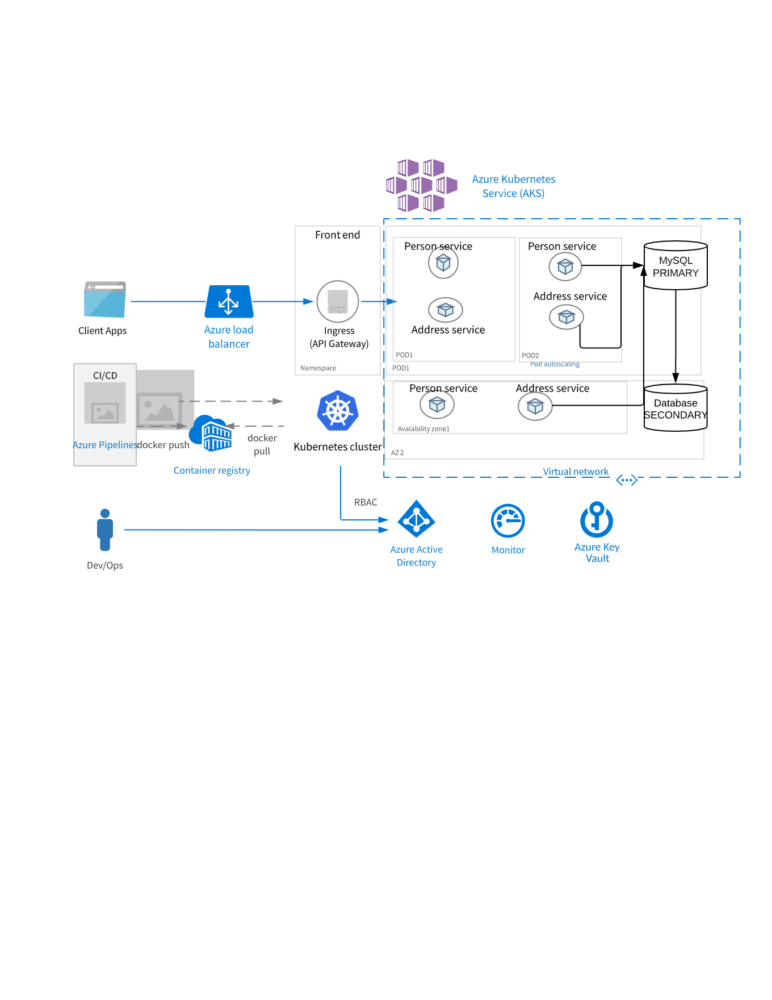
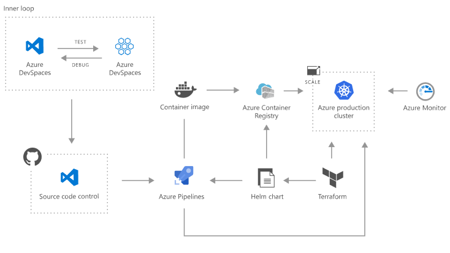

 
##  Person & Address API Project

This is a project based on Spring Boot and Spring Cloud. It is intended as a Reference not used in productin 

## Why Spring Boot & Cloud Modules.

* Using Spring Boot 2 in cloud-native development
* Providing service discovery for all microservices with Spring Cloud Netflix Eureka
* Distributed configuration with Spring Cloud Config
* API Gateway pattern using a new project inside Spring Cloud: Spring Cloud Gateway
* Spring H2 In memory Database to store the Person and Address.

## Modules

The main parts of the Maven multi modules are:

* config-service
* discovery-service
* gateway-service
* person-service
* proxy-service

## How to build
Go to person-service and run the maven command
    cd person-service
    mvn clean install 
    java -jar target/person-servie*.jar

## How to test . attached Postman json file . can import and run all the Services.
    Note - Please change port number in POST request based on your local server availability.

     PersonAPI.postman_collection.json

## Swagger Documentation 
    
## Architecture Decision

* Enabling Docker Builds as well to support Kubernetes deployment . 
* Jenkins will build the Images and push it to ACR Container registry
* Better to use Spring Cloud Kubernetes service instead of Spring Eureka and Config service .
* Spring Kubernetes can help to to replace Config service with Config Map and Secret password and configuration will be distributed.
* Ingress instead of ZUUL API gateway to delegate to required service and provide authentication at GATEWAY level.
* Inter service communication Resttemplate 

* Primary & Secondary for the SQL Database , MY SQL can be used. Writes needs to be always sent to primary .
* Evetual consistency can be achienved with primary & Secondary . Secondary only used for reads.

## High level architecture diagram

## CICD process

## TODO

* Pagination 
* Authentication & Authorization using JWT or OAUTH2
* ID change from int to long or String
* Inter process communication as i have put both address and person in the same service.
* Kubernetes scripts , tried to create Docker images. 
* Unit Tests . 

